# Arceus Code UI Preview Pack

Generated reference storyboard for the desktop-only Arceus Code experience. Every numbered callout maps to a button/action and its dependency.

## Desktop Shell - Signed Out
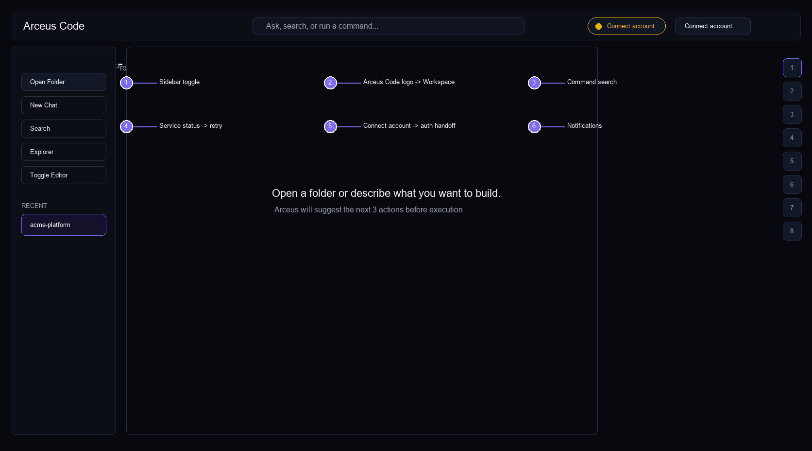

Connect account state, no Product Hub / PA / Interview / Admin / public Login / Sign up.

| # | Button / state | Click behavior | Disabled/error state | Dependency |
|---|---|---|---|---|
| 1 | Sidebar toggle | Executes the named action in the active Arceus Code project. | Shows tooltip and structured receipt when unavailable. | Frontend state |
| 2 | Arceus Code logo -> Workspace | Executes the named action in the active Arceus Code project. | Shows tooltip and structured receipt when unavailable. | Frontend state |
| 3 | Command search | Executes the named action in the active Arceus Code project. | Shows tooltip and structured receipt when unavailable. | Frontend state |
| 4 | Service status -> retry | Executes the named action in the active Arceus Code project. | Shows tooltip and structured receipt when unavailable. | Frontend state |
| 5 | Connect account -> auth handoff | Executes the named action in the active Arceus Code project. | Shows tooltip and structured receipt when unavailable. | Agent API / Clerk session |
| 6 | Notifications | Executes the named action in the active Arceus Code project. | Shows tooltip and structured receipt when unavailable. | Frontend state |

## Desktop Shell - Signed In
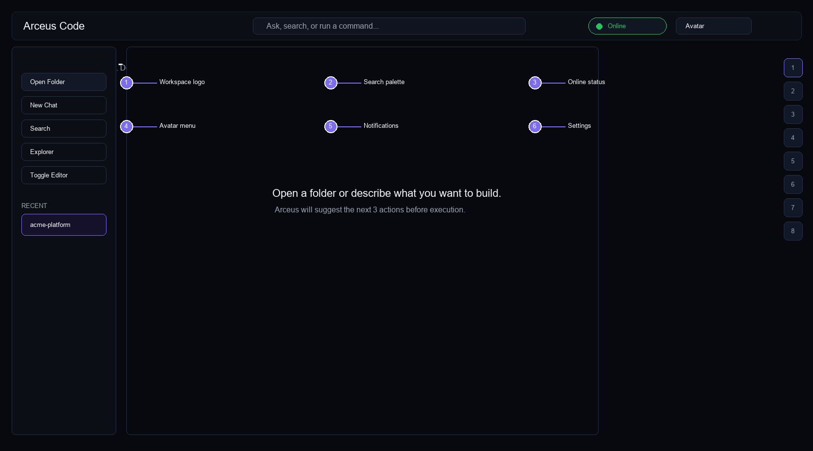

Avatar replaces auth CTAs. Desktop stays Code-only.

| # | Button / state | Click behavior | Disabled/error state | Dependency |
|---|---|---|---|---|
| 1 | Workspace logo | Executes the named action in the active Arceus Code project. | Shows tooltip and structured receipt when unavailable. | Frontend state |
| 2 | Search palette | Executes the named action in the active Arceus Code project. | Shows tooltip and structured receipt when unavailable. | Frontend state |
| 3 | Online status | Executes the named action in the active Arceus Code project. | Shows tooltip and structured receipt when unavailable. | Frontend state |
| 4 | Avatar menu | Executes the named action in the active Arceus Code project. | Shows tooltip and structured receipt when unavailable. | Frontend state |
| 5 | Notifications | Executes the named action in the active Arceus Code project. | Shows tooltip and structured receipt when unavailable. | Frontend state |
| 6 | Settings | Executes the named action in the active Arceus Code project. | Shows tooltip and structured receipt when unavailable. | Frontend state |

## API Offline - Local Mode
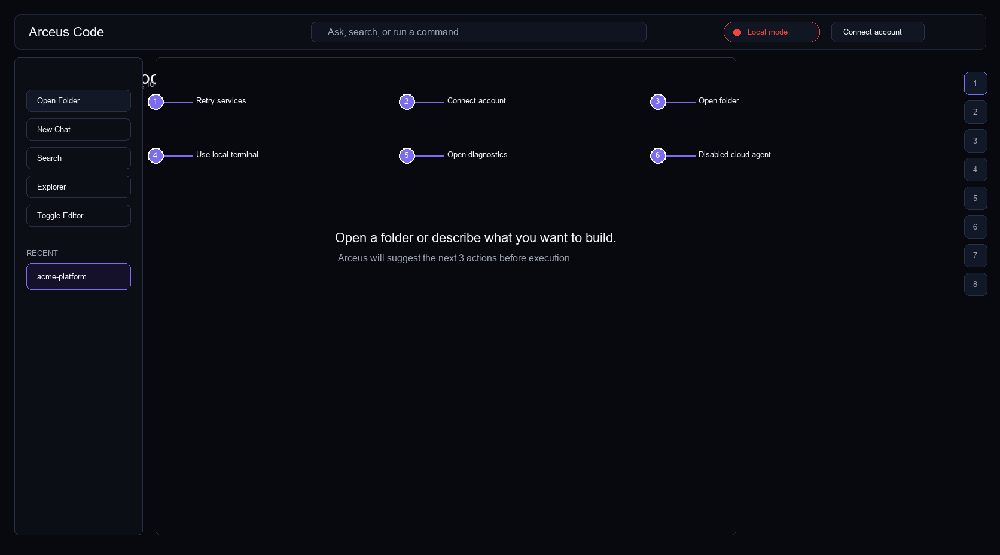

Cloud actions are disabled, local folder/editor/terminal remain enabled.

| # | Button / state | Click behavior | Disabled/error state | Dependency |
|---|---|---|---|---|
| 1 | Retry services | Executes the named action in the active Arceus Code project. | Shows tooltip and structured receipt when unavailable. | Frontend state |
| 2 | Connect account | Executes the named action in the active Arceus Code project. | Shows tooltip and structured receipt when unavailable. | Agent API / Clerk session |
| 3 | Open folder | Executes the named action in the active Arceus Code project. | Shows tooltip and structured receipt when unavailable. | Local desktop runtime |
| 4 | Use local terminal | Executes the named action in the active Arceus Code project. | Shows tooltip and structured receipt when unavailable. | Local desktop runtime |
| 5 | Open diagnostics | Executes the named action in the active Arceus Code project. | Shows tooltip and structured receipt when unavailable. | Frontend state |
| 6 | Disabled cloud agent | Executes the named action in the active Arceus Code project. | Shows tooltip and structured receipt when unavailable. | Agent API / Clerk session |

## Workspace Empty
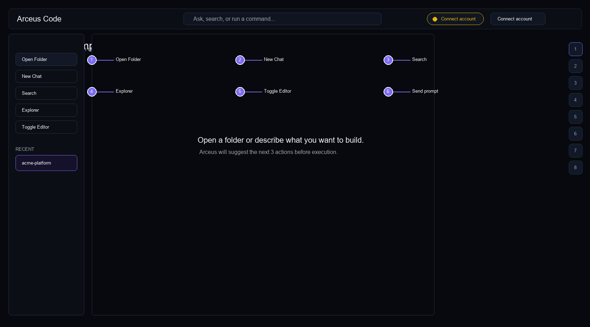

First launch workspace with clear primary actions.

| # | Button / state | Click behavior | Disabled/error state | Dependency |
|---|---|---|---|---|
| 1 | Open Folder | Executes the named action in the active Arceus Code project. | Shows tooltip and structured receipt when unavailable. | Local desktop runtime |
| 2 | New Chat | Executes the named action in the active Arceus Code project. | Shows tooltip and structured receipt when unavailable. | Frontend state |
| 3 | Search | Executes the named action in the active Arceus Code project. | Shows tooltip and structured receipt when unavailable. | Frontend state |
| 4 | Explorer | Executes the named action in the active Arceus Code project. | Shows tooltip and structured receipt when unavailable. | Frontend state |
| 5 | Toggle Editor | Executes the named action in the active Arceus Code project. | Shows tooltip and structured receipt when unavailable. | Frontend state |
| 6 | Send prompt | Executes the named action in the active Arceus Code project. | Shows tooltip and structured receipt when unavailable. | Agent API / Clerk session |

## Open Folder + File Tree
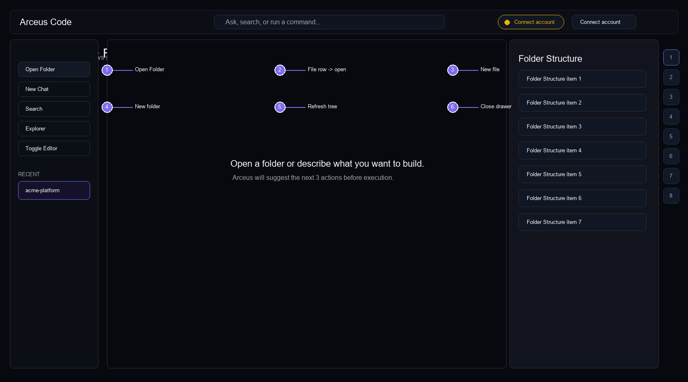

Right Explorer drawer shows source-of-truth folder structure.

| # | Button / state | Click behavior | Disabled/error state | Dependency |
|---|---|---|---|---|
| 1 | Open Folder | Executes the named action in the active Arceus Code project. | Shows tooltip and structured receipt when unavailable. | Local desktop runtime |
| 2 | File row -> open | Executes the named action in the active Arceus Code project. | Shows tooltip and structured receipt when unavailable. | Local desktop runtime |
| 3 | New file | Executes the named action in the active Arceus Code project. | Shows tooltip and structured receipt when unavailable. | Local desktop runtime |
| 4 | New folder | Executes the named action in the active Arceus Code project. | Shows tooltip and structured receipt when unavailable. | Local desktop runtime |
| 5 | Refresh tree | Executes the named action in the active Arceus Code project. | Shows tooltip and structured receipt when unavailable. | Frontend state |
| 6 | Close drawer | Executes the named action in the active Arceus Code project. | Shows tooltip and structured receipt when unavailable. | Frontend state |

## Editor + Chat + Bottom Terminal
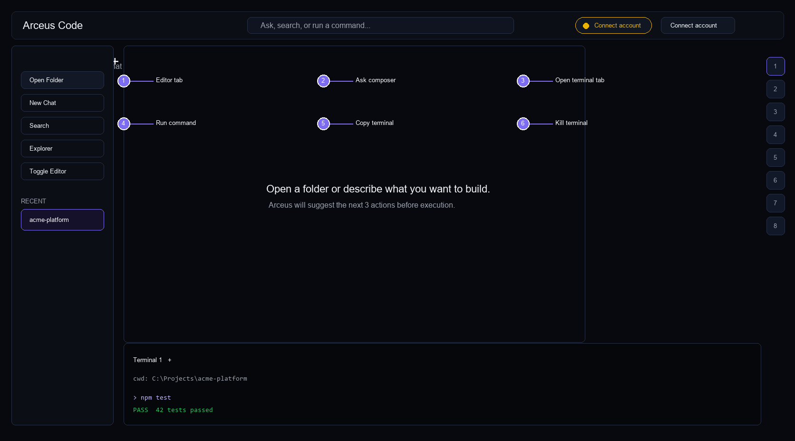

Main coding loop: editor, chat receipt area, terminal at bottom.

| # | Button / state | Click behavior | Disabled/error state | Dependency |
|---|---|---|---|---|
| 1 | Editor tab | Executes the named action in the active Arceus Code project. | Shows tooltip and structured receipt when unavailable. | Frontend state |
| 2 | Ask composer | Executes the named action in the active Arceus Code project. | Shows tooltip and structured receipt when unavailable. | Frontend state |
| 3 | Open terminal tab | Executes the named action in the active Arceus Code project. | Shows tooltip and structured receipt when unavailable. | Local desktop runtime |
| 4 | Run command | Executes the named action in the active Arceus Code project. | Shows tooltip and structured receipt when unavailable. | Frontend state |
| 5 | Copy terminal | Executes the named action in the active Arceus Code project. | Shows tooltip and structured receipt when unavailable. | Local desktop runtime |
| 6 | Kill terminal | Executes the named action in the active Arceus Code project. | Shows tooltip and structured receipt when unavailable. | Local desktop runtime |

## Auto-Applied Work Receipt
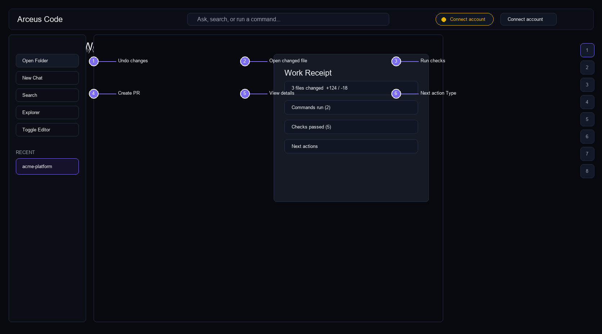

Safe edits apply immediately with Undo as primary recovery.

| # | Button / state | Click behavior | Disabled/error state | Dependency |
|---|---|---|---|---|
| 1 | Undo changes | Executes the named action in the active Arceus Code project. | Shows tooltip and structured receipt when unavailable. | Frontend state |
| 2 | Open changed file | Executes the named action in the active Arceus Code project. | Shows tooltip and structured receipt when unavailable. | Local desktop runtime |
| 3 | Run checks | Executes the named action in the active Arceus Code project. | Shows tooltip and structured receipt when unavailable. | Frontend state |
| 4 | Create PR | Executes the named action in the active Arceus Code project. | Shows tooltip and structured receipt when unavailable. | Agent API / Clerk session |
| 5 | View details | Executes the named action in the active Arceus Code project. | Shows tooltip and structured receipt when unavailable. | Frontend state |
| 6 | Next action Type | Executes the named action in the active Arceus Code project. | Shows tooltip and structured receipt when unavailable. | Frontend state |

## Risky Change Review Required
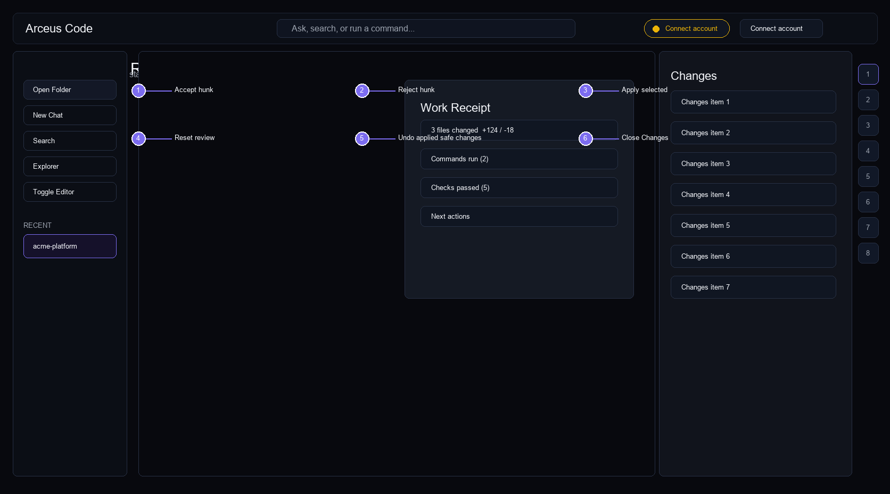

Deletes, renames, conflicts stay in Changes drawer.

| # | Button / state | Click behavior | Disabled/error state | Dependency |
|---|---|---|---|---|
| 1 | Accept hunk | Executes the named action in the active Arceus Code project. | Shows tooltip and structured receipt when unavailable. | Frontend state |
| 2 | Reject hunk | Executes the named action in the active Arceus Code project. | Shows tooltip and structured receipt when unavailable. | Frontend state |
| 3 | Apply selected | Executes the named action in the active Arceus Code project. | Shows tooltip and structured receipt when unavailable. | Frontend state |
| 4 | Reset review | Executes the named action in the active Arceus Code project. | Shows tooltip and structured receipt when unavailable. | Frontend state |
| 5 | Undo applied safe changes | Executes the named action in the active Arceus Code project. | Shows tooltip and structured receipt when unavailable. | Frontend state |
| 6 | Close Changes | Executes the named action in the active Arceus Code project. | Shows tooltip and structured receipt when unavailable. | Frontend state |

## Jobs Drawer
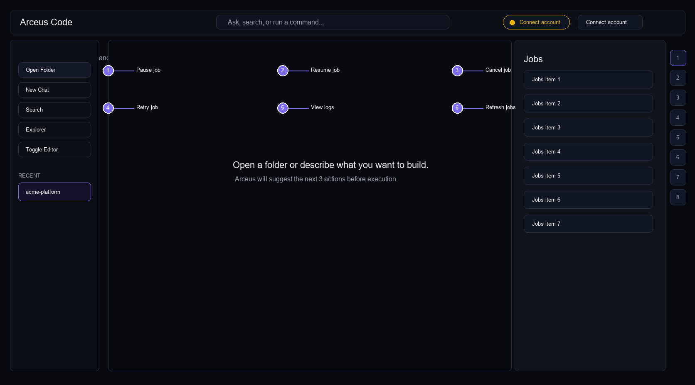

Compact durable job rows and controls.

| # | Button / state | Click behavior | Disabled/error state | Dependency |
|---|---|---|---|---|
| 1 | Pause job | Executes the named action in the active Arceus Code project. | Shows tooltip and structured receipt when unavailable. | Frontend state |
| 2 | Resume job | Executes the named action in the active Arceus Code project. | Shows tooltip and structured receipt when unavailable. | Frontend state |
| 3 | Cancel job | Executes the named action in the active Arceus Code project. | Shows tooltip and structured receipt when unavailable. | Frontend state |
| 4 | Retry job | Executes the named action in the active Arceus Code project. | Shows tooltip and structured receipt when unavailable. | Frontend state |
| 5 | View logs | Executes the named action in the active Arceus Code project. | Shows tooltip and structured receipt when unavailable. | Frontend state |
| 6 | Refresh jobs | Executes the named action in the active Arceus Code project. | Shows tooltip and structured receipt when unavailable. | Frontend state |

## Preview Verification
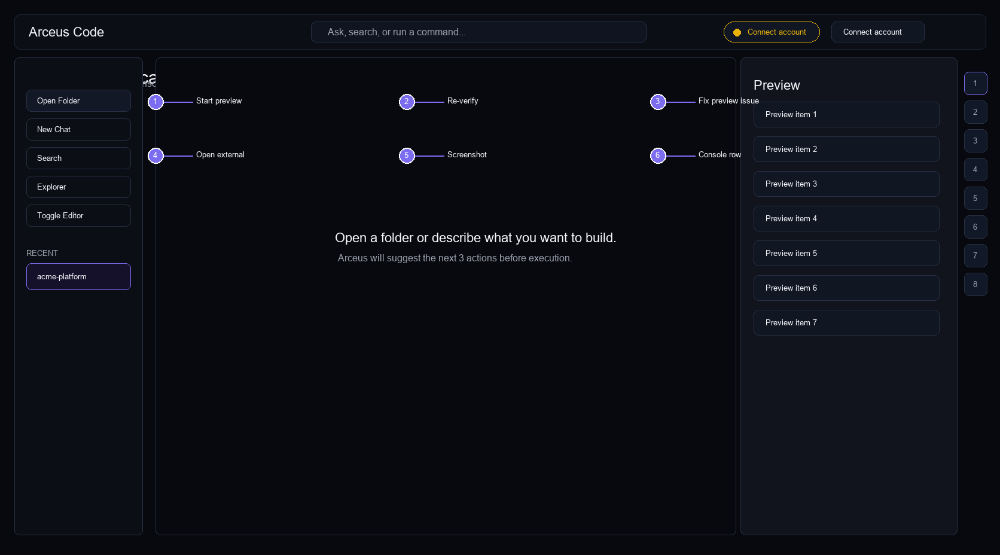

Iframe, screenshot strip, console/network evidence.

| # | Button / state | Click behavior | Disabled/error state | Dependency |
|---|---|---|---|---|
| 1 | Start preview | Executes the named action in the active Arceus Code project. | Shows tooltip and structured receipt when unavailable. | Agent API / Clerk session |
| 2 | Re-verify | Executes the named action in the active Arceus Code project. | Shows tooltip and structured receipt when unavailable. | Frontend state |
| 3 | Fix preview issue | Executes the named action in the active Arceus Code project. | Shows tooltip and structured receipt when unavailable. | Agent API / Clerk session |
| 4 | Open external | Executes the named action in the active Arceus Code project. | Shows tooltip and structured receipt when unavailable. | Frontend state |
| 5 | Screenshot | Executes the named action in the active Arceus Code project. | Shows tooltip and structured receipt when unavailable. | Frontend state |
| 6 | Console row | Executes the named action in the active Arceus Code project. | Shows tooltip and structured receipt when unavailable. | Frontend state |

## Git PR Flow
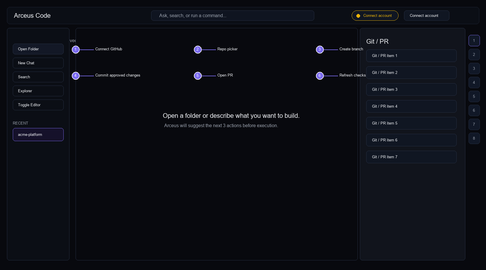

Repo picker, branch, approved changes, PR checks.

| # | Button / state | Click behavior | Disabled/error state | Dependency |
|---|---|---|---|---|
| 1 | Connect GitHub | Executes the named action in the active Arceus Code project. | Shows tooltip and structured receipt when unavailable. | Agent API / Clerk session |
| 2 | Repo picker | Executes the named action in the active Arceus Code project. | Shows tooltip and structured receipt when unavailable. | Frontend state |
| 3 | Create branch | Executes the named action in the active Arceus Code project. | Shows tooltip and structured receipt when unavailable. | Frontend state |
| 4 | Commit approved changes | Executes the named action in the active Arceus Code project. | Shows tooltip and structured receipt when unavailable. | Agent API / Clerk session |
| 5 | Open PR | Executes the named action in the active Arceus Code project. | Shows tooltip and structured receipt when unavailable. | Agent API / Clerk session |
| 6 | Refresh checks | Executes the named action in the active Arceus Code project. | Shows tooltip and structured receipt when unavailable. | Frontend state |

## Settings - Arceus Code
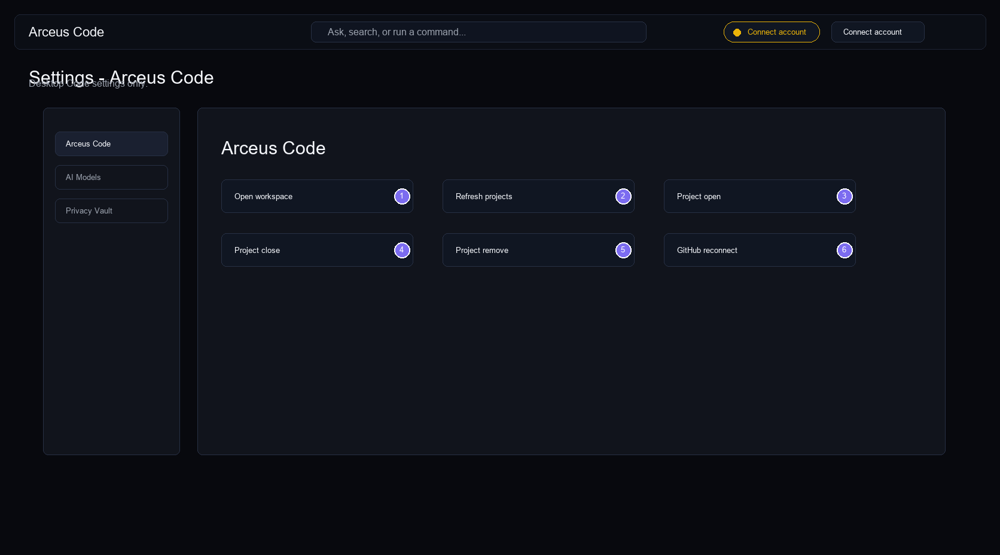

Desktop Code settings only.

| # | Button / state | Click behavior | Disabled/error state | Dependency |
|---|---|---|---|---|
| 1 | Open workspace | Executes the named action in the active Arceus Code project. | Shows tooltip and structured receipt when unavailable. | Frontend state |
| 2 | Refresh projects | Executes the named action in the active Arceus Code project. | Shows tooltip and structured receipt when unavailable. | Agent API / Clerk session |
| 3 | Project open | Executes the named action in the active Arceus Code project. | Shows tooltip and structured receipt when unavailable. | Agent API / Clerk session |
| 4 | Project close | Executes the named action in the active Arceus Code project. | Shows tooltip and structured receipt when unavailable. | Agent API / Clerk session |
| 5 | Project remove | Executes the named action in the active Arceus Code project. | Shows tooltip and structured receipt when unavailable. | Agent API / Clerk session |
| 6 | GitHub reconnect | Executes the named action in the active Arceus Code project. | Shows tooltip and structured receipt when unavailable. | Agent API / Clerk session |

## Settings - AI Models
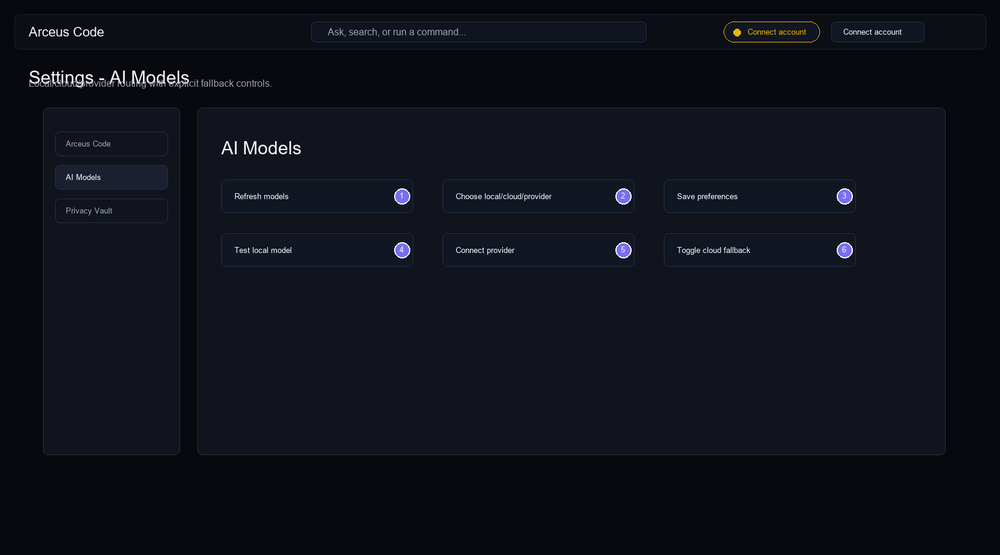

Local/cloud/provider routing with explicit fallback controls.

| # | Button / state | Click behavior | Disabled/error state | Dependency |
|---|---|---|---|---|
| 1 | Refresh models | Executes the named action in the active Arceus Code project. | Shows tooltip and structured receipt when unavailable. | Agent API / Clerk session |
| 2 | Choose local/cloud/provider | Executes the named action in the active Arceus Code project. | Shows tooltip and structured receipt when unavailable. | Local desktop runtime |
| 3 | Save preferences | Executes the named action in the active Arceus Code project. | Shows tooltip and structured receipt when unavailable. | Agent API / Clerk session |
| 4 | Test local model | Executes the named action in the active Arceus Code project. | Shows tooltip and structured receipt when unavailable. | Local desktop runtime |
| 5 | Connect provider | Executes the named action in the active Arceus Code project. | Shows tooltip and structured receipt when unavailable. | Agent API / Clerk session |
| 6 | Toggle cloud fallback | Executes the named action in the active Arceus Code project. | Shows tooltip and structured receipt when unavailable. | Frontend state |

## Settings - Privacy Vault
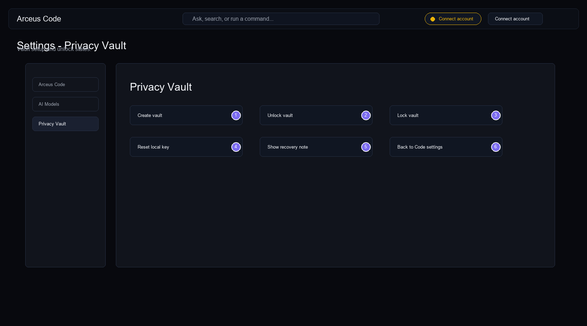

Vault setup and unlock states.

| # | Button / state | Click behavior | Disabled/error state | Dependency |
|---|---|---|---|---|
| 1 | Create vault | Executes the named action in the active Arceus Code project. | Shows tooltip and structured receipt when unavailable. | Frontend state |
| 2 | Unlock vault | Executes the named action in the active Arceus Code project. | Shows tooltip and structured receipt when unavailable. | Frontend state |
| 3 | Lock vault | Executes the named action in the active Arceus Code project. | Shows tooltip and structured receipt when unavailable. | Frontend state |
| 4 | Reset local key | Executes the named action in the active Arceus Code project. | Shows tooltip and structured receipt when unavailable. | Local desktop runtime |
| 5 | Show recovery note | Executes the named action in the active Arceus Code project. | Shows tooltip and structured receipt when unavailable. | Frontend state |
| 6 | Back to Code settings | Executes the named action in the active Arceus Code project. | Shows tooltip and structured receipt when unavailable. | Frontend state |

## Download Page
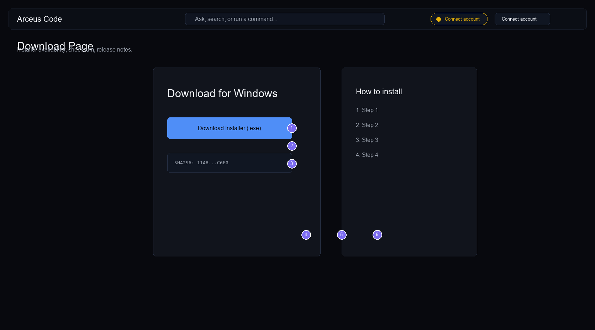

Installer availability, checksum, release notes.

| # | Button / state | Click behavior | Disabled/error state | Dependency |
|---|---|---|---|---|
| 1 | Download Windows installer | Executes the named action in the active Arceus Code project. | Shows tooltip and structured receipt when unavailable. | Frontend state |
| 2 | Copy SHA256 | Executes the named action in the active Arceus Code project. | Shows tooltip and structured receipt when unavailable. | Frontend state |
| 3 | View release notes | Executes the named action in the active Arceus Code project. | Shows tooltip and structured receipt when unavailable. | Frontend state |
| 4 | Windows tab | Executes the named action in the active Arceus Code project. | Shows tooltip and structured receipt when unavailable. | Frontend state |
| 5 | macOS tab | Executes the named action in the active Arceus Code project. | Shows tooltip and structured receipt when unavailable. | Frontend state |
| 6 | Linux tab | Executes the named action in the active Arceus Code project. | Shows tooltip and structured receipt when unavailable. | Frontend state |
